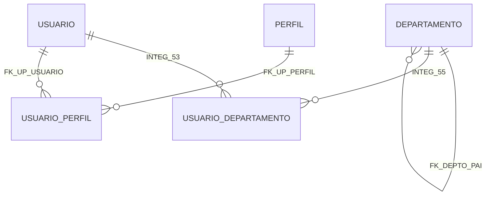

# jed-personal-mcp

Um servidor MCP (Model Context Protocol) pessoal para desenvolvimento local, escrito em Go.

Fornece acesso auma instância local do Firebird 5 para seu LLM.

É adequado para uso com o [Zed Editor](https://zed.dev) em tarefas de desenvolvimento.

> **Aviso:** Esta ferramenta é destinada apenas para desenvolvimento local. Não é segura para uso em produção.

> **Nota:** Ferramentas de backup e restore (gbak, nbackup) foram intencionalmente excluídas, pois este projeto é focado em fluxos de desenvolvimento. Para backup/restore em produção, use as ferramentas nativas do Firebird diretamente.

## Funcionalidades

### Query & Dados
- **`firebird_query`** — Executa uma única instrução SQL (SELECT, INSERT, UPDATE, CREATE TABLE, etc.)
- **`firebird_count`** — Conta linhas em uma tabela (com WHERE opcional)
- **`firebird_sample`** — Obtém uma amostra de linhas de uma tabela (com WHERE e LIMIT opcionais)
- **`firebird_insert_batch`** — Insere múltiplas linhas em uma única transação (prepared statement)

### Schema & Estrutura
- **`firebird_describe_table`** — Mostra o schema completo de uma tabela ou view (colunas, índices, constraints, triggers, comments)
- **`firebird_describe_database`** — Visão completa do banco com tabelas, colunas e diagrama ER Mermaid
- **`firebird_get_databases`** — Lista todos os bancos configurados

### DDL & Avançado
- **`firebird_create_database`** — Cria um novo arquivo de banco Firebird (restrito a caminhos permitidos)
- **`firebird_run_script`** — Executa múltiplas instruções SQL em uma única transação
- **`firebird_create_trigger`** — Cria um novo trigger (usa isql para suporte a SET TERM)
- **`firebird_execute_immediate`** — Executa instruções com blocos SET TERM (procedures, generators, functions) (usa isql)
- **`firebird_alter_column_type`** — Altera o tipo de dados de uma coluna para usar um domain
- **`firebird_drop`** — Remove um objeto do banco (tabela, view, domain, trigger, procedure, function, index, sequence)
- **`firebird_metadata_extract`** — Extrai metadados completos do banco (script DDL) usando isql -x

### Descoberta
- **`firebird_list`** — Lista objetos do banco por tipo (TABLES, PROCEDURES, FUNCTIONS, DOMAINS, TRIGGERS, INDEXES, SEQUENCES)

## Pré-requisitos

- [Go](https://go.dev/) 1.21+
- Servidor [Firebird 5](https://www.firebirdsql.org/) rodando localmente (ou acessível pela rede)

## Configuração

### 1. Configure seu servidor e bancos de dados

Edite `config.json`:

```json
{
  "server": {
    "host": "127.0.0.1",
    "port": 3050,
    "user": "SYSDBA",
    "password": "masterkey",
    "allowed_paths": [
      "/databases"
    ],
    "databases": [
      {
        "name": "dev",
        "description": "Banco de dados de desenvolvimento local",
        "path": "/databases/dev.fdb"
      }
    ],
    "default_database": "dev",
    "isql_path": "/usr/bin/isql"
  }
}
```

**Nota:** O campo `isql_path` é opcional. Se não definido, o servidor buscará automaticamente `isql` ou `fbisql` em locais comuns e no PATH. Isso é necessário para ferramentas que usam blocos SET TERM (`firebird_create_trigger`, `firebird_execute_immediate`).

### 2. Build

```bash
# Build para a plataforma atual (desenvolvimento)
./scripts/build.sh

# Build para uma plataforma específica
./scripts/build.sh linux      # linux/amd64 + linux/arm64
./scripts/build.sh darwin     # darwin/amd64 + darwin/arm64
./scripts/build.sh windows    # windows/amd64 + windows/arm64

# Build para todas as plataformas
./scripts/build.sh all
```
Os binários são gerados em `bin/`.

### 3. Registre no Zed Editor

Adicione o servidor MCP às configurações do Zed (`~/.config/zed/settings.json`):

```json
{
  "context_servers": {
    "jed-personal-mcp": {
      "command": "/home/edujed/github/jed-personal-mcp/bin/jed-personal-mcp",
      "enabled": true,
      "env": {
        "FIREBIRD_CONFIG": "/home/edujed/github/jed-personal-mcp/config.json"
      },
      "timeout": 20
    }
  }
}
```

| Campo | Descrição |
|---|---|
| `command` | Caminho absoluto para o binário compilado |
| `enabled` | Se o servidor está ativo (`true`/`false`) |
| `env.FIREBIRD_CONFIG` | Caminho para `config.json` (opcional — padrão: `./config.json` relativo ao diretório de trabalho) |
| `timeout` | Timeout em segundos para inicialização do servidor |

Após salvar, o Zed iniciará automaticamente o servidor MCP e tornará as ferramentas disponíveis para o agente.

## Configuração

### `config.json`

| Campo | Tipo | Descrição |
|---|---|---|
| `server.host` | `string` | Host do servidor Firebird |
| `server.port` | `int` | Porta do servidor Firebird |
| `server.user` | `string` | Usuário administrador do servidor |
| `server.password` | `string` | Senha do administrador do servidor |
| `server.allowed_paths` | `array` | Diretórios onde novos bancos podem ser criados |
| `server.databases` | `array` | Lista de configurações de bancos de dados |
| `server.default_database` | `string` | Nome do banco a usar quando nenhum for especificado |

### Entrada de banco de dados

| Campo | Tipo | Descrição |
|---|---|---|
| `name` | `string` | Identificador único usado nas chamadas de ferramentas |
| `description` | `string` | Descrição legível (opcional) |
| `path` | `string` | Caminho para o arquivo `.fdb` |

### Busca do arquivo de configuração

O servidor busca o arquivo de configuração na seguinte ordem:

1. **Variável de ambiente `FIREBIRD_CONFIG`** — se definida, este caminho é usado
2. **`./config.json`** — relativo ao diretório de trabalho atual

### Variáveis de ambiente

| Variável | Descrição |
|---|---|
| `FIREBIRD_CONFIG` | Caminho absoluto para o arquivo de configuração |

## Ferramentas

Todas as ferramentas retornam resultados em **formato Markdown** para melhor legibilidade e eficiência de tokens.

### `firebird_query`

Executa uma instrução SQL bruta contra o banco de dados.

| Argumento | Tipo | Obrigatório | Descrição |
|---|---|---|---|
| `sql` | `string` | Sim | A instrução SQL a executar |
| `database` | `string` | Não | Nome do banco (padrão: `default_database`) |

**Exemplo de saída:**

```markdown
### Query Results (3 rows)

Columns: ID (INT), NAME (VARCHAR), CITY (VARCHAR)

ID | NAME | CITY
--- | --- | ---
1 | Alice | São Paulo
2 | Bob | NULL
3 | Charlie | Rio de Janeiro
```

### `firebird_list`

Lista objetos do banco por tipo. Tipos suportados: `TABLES`, `PROCEDURES`, `FUNCTIONS`, `DOMAINS`, `TRIGGERS`, `INDEXES`, `SEQUENCES`.

| Argumento | Tipo | Obrigatório | Descrição |
|---|---|---|---|
| `type` | `string` | Sim | Tipo de objeto a listar |
| `database` | `string` | Não | Nome do banco (padrão: `default_database`) |

**Exemplo de saída (type=TABLES):**

```markdown
### Tables and Views (5)

NAME | TYPE | COMMENT
--- | --- | ---
CLIENTS | TABLE | Customer records
ORDERS | TABLE | Order data
PRODUCTS | TABLE | Product catalog
ORDERS_VIEW | VIEW | Orders with client info
STATS | TABLE | -
```

**Exemplo de saída (type=DOMAINS):**

```markdown
### Domains (Named Data Types)

Count: 30 domains

NAME | TYPE | DEFAULT | NULL
--- | --- | --- | ---
D_BLOB_TEXT | BLOB | - | YES
D_BOOLEAN | BOOLEAN | - | YES
D_DATE | DATE | - | YES
D_INTEGER | INTEGER | - | YES
D_MONEY | NUMERIC(14,2) | - | YES
D_PERCENT | NUMERIC(5,2) | - | YES
D_REQUIRED_VARCHAR_100 | VARCHAR(100) | - | NO
D_TIMESTAMP | TIMESTAMP | - | YES
```

> **Nota:** A coluna TYPE mostra o tipo completo com tamanho/precisão (ex.: `VARCHAR(100)`, `NUMERIC(14,2)`, `DATE`, `TIMESTAMP`). Tamanhos de caracteres são convertidos de bytes para caracteres (UTF8 = 4 bytes/char).

### `firebird_describe_table`

Mostra o schema completo de uma tabela ou view, incluindo colunas (com tipo, tamanho, nullability, default), índices, constraints, triggers e comments.

| Argumento | Tipo | Obrigatório | Descrição |
|---|---|---|---|
| `table_name` | `string` | Sim | Nome da tabela ou view |
| `database` | `string` | Não | Nome do banco (padrão: `default_database`) |

**Exemplo de saída:**

```markdown
### Table: CLIENTS

#### Columns

NAME | TYPE | DOMAIN | NULL | DEFAULT | POSITION
--- | --- | --- | --- | --- | ---
ID | INTEGER | - | NO | - | 1
NAME | VARCHAR(100) | D_REQUIRED_VARCHAR_100 | NO | - | 2
EMAIL | VARCHAR(255) | - | YES | - | 3
CREATED_AT | TIMESTAMP | D_TIMESTAMP | NO | CURRENT_TIMESTAMP | 4

#### Indexes

NAME | UNIQUE | TYPE | COLUMNS
--- | --- | --- | ---
IDX_CLIENTS_ID | YES | 0 | ID
IDX_CLIENTS_EMAIL | NO | 0 | EMAIL

#### Constraints

NAME | TYPE
--- | ---
PK_CLIENTS | PRIMARY KEY

#### Triggers

NAME | TYPE | SEQUENCE
--- | --- | ---
TRG_CLIENTS_AUDIT | 1 | 0

#### Comments

COLUMN | COMMENT
--- | ---
ID | Primary key
NAME | Customer full name
```

### `firebird_describe_database`

Fornece uma visão completa da estrutura do banco, incluindo todas as tabelas com detalhes das colunas, contagem de linhas (opcional) e um diagrama ER Mermaid mostrando todos os relacionamentos.

| Argumento | Tipo | Obrigatório | Descrição |
|---|---|---|---|
| `database` | `string` | Não | Nome do banco (padrão: `default_database`) |
| `include_counts` | `boolean` | Não | Se true, inclui contagem de linhas para cada tabela. Pode ser lento para tabelas grandes. Padrão: `false`. |
| `include_describes` | `boolean` | Não | Se true, inclui detalhes das colunas para cada tabela. Padrão: `true`. |

**Exemplo de saída:**

```markdown
### Database: teste

#### Tables (19)

**DEPARTAMENTO** (14 rows)
  - ID (INTEGER, PK)
  - NOME (VARCHAR(400))
  - SIGLA (VARCHAR(40))
  - ATIVO (SMALLINT)
  - CRIADO_EM (TIMESTAMP, NOT NULL)
  - ATUALIZADO_EM (TIMESTAMP, NOT NULL)
  - PAI_ID (INTEGER, NOT NULL)
  - TIPO (VARCHAR(80), NOT NULL)
  - FILIAL_ID (INTEGER, NOT NULL)

**USUARIO** (220 rows)
  - ID (INTEGER, PK)
  - NOME (VARCHAR(400))
  - EMAIL (VARCHAR(600))
  - SENHA_HASH (VARCHAR(1020))
  - ATIVO (SMALLINT)
  - CRIADO_EM (TIMESTAMP, NOT NULL)
  - ATUALIZADO_EM (TIMESTAMP, NOT NULL)
  - SALARIO (INT64, NOT NULL)
  - MATRICULA (VARCHAR(80), NOT NULL)

#### Relationships (Mermaid)

```

### `firebird_get_databases`

Lista todos os bancos de dados definidos em `config.json`.

Nenhum argumento necessário.

**Exemplo de saída:**

```markdown
### Configured Databases (2)

NAME | DESCRIPTION | PATH | DEFAULT
--- | --- | --- | ---
dev | Local development database | /databases/dev.fdb | YES
prod | Production database (read-only) | /databases/prod.fdb | NO
```

### `firebird_create_database`

Cria um novo arquivo de banco Firebird com page size fixo de 4096 bytes. O caminho deve estar dentro de um dos diretórios `allowed_paths`.

| Argumento | Tipo | Obrigatório | Descrição |
|---|---|---|---|
| `path` | `string` | Sim | Caminho completo para o novo arquivo `.fdb` |

### `firebird_run_script`

Executa um script SQL (múltiplas instruções) em uma única transação. As instruções são separadas por ponto e vírgula. Se qualquer instrução falhar, a transação inteira é revertida.

| Argumento | Tipo | Obrigatório | Descrição |
|---|---|---|---|
| `database` | `string` | Sim | Nome do banco (obrigatório para evitar ambiguidade) |
| `script` | `string` | Não | O script SQL a executar (inline) |
| `path` | `string` | Não | Caminho para um arquivo `.sql` a executar |

> **Nota:** Deve ser fornecido `script` ou `path`.

### `firebird_create_trigger`

Cria um novo trigger no banco de dados. Trata o delimitador `SET TERM` automaticamente.

| Argumento | Tipo | Obrigatório | Descrição |
|---|---|---|---|
| `database` | `string` | Sim | Nome do banco |
| `trigger_name` | `string` | Sim | Nome para o novo trigger |
| `table_name` | `string` | Sim | Tabela com a qual o trigger será associado |
| `trigger_type` | `string` | Sim | Evento do trigger: `INSERT`, `UPDATE` ou `DELETE` |
| `timing` | `string` | Sim | Timing do trigger: `BEFORE` ou `AFTER` |
| `body` | `string` | Sim | Corpo do trigger (instruções SQL, sem `SET TERM` ou `BEGIN/END`) |

### `firebird_insert_batch`

Insere múltiplas linhas em uma tabela em uma única transação usando prepared statement. Mais eficiente que múltiplas chamadas `firebird_query` para INSERTs individuais.

| Argumento | Tipo | Obrigatório | Descrição |
|---|---|---|---|
| `database` | `string` | Não | Nome do banco (padrão: `default_database`) |
| `table` | `string` | Sim | Nome da tabela para inserção |
| `columns` | `string` | Sim | Nomes das colunas como array JSON, ex.: `["NAME", "EMAIL"]` |
| `rows` | `string` | Sim | Dados das linhas como array JSON de arrays, ex.: `[["Alice", "a@x.com"], ["Bob", "b@x.com"]]` |

**Exemplo de saída:**

```
Inserted 2 rows into CLIENTS.
```

### `firebird_count`

Retorna o número de linhas em uma tabela, opcionalmente filtrado por uma cláusula WHERE.

| Argumento | Tipo | Obrigatório | Descrição |
|---|---|---|---|
| `database` | `string` | Não | Nome do banco (padrão: `default_database`) |
| `table` | `string` | Sim | Nome da tabela para contar linhas |
| `where` | `string` | Não | Cláusula WHERE opcional (sem a palavra WHERE) |

**Exemplo de saída:**

```
Count: 42 rows in CLIENTS (WHERE STATUS = 'ACTIVE')
```

### `firebird_sample`

Retorna uma amostra de linhas de uma tabela (padrão: 10 linhas), opcionalmente filtrada por uma cláusula WHERE.

| Argumento | Tipo | Obrigatório | Descrição |
|---|---|---|---|
| `database` | `string` | Não | Nome do banco (padrão: `default_database`) |
| `table` | `string` | Sim | Nome da tabela para amostrar |
| `where` | `string` | Não | Cláusula WHERE opcional (sem a palavra WHERE) |
| `limit` | `string` | Não | Número máximo de linhas a retornar (padrão: 10) |

**Exemplo de saída:**

```markdown
### Query Results (10 rows)

Columns: ID (INT), NAME (VARCHAR), STATUS (VARCHAR)

ID | NAME | STATUS
--- | --- | ---
1 | Alice | ACTIVE
2 | Bob | INACTIVE
3 | Charlie | ACTIVE
```

### `firebird_execute_immediate`

Executa uma instrução SQL que pode conter blocos SET TERM (ex.: CREATE PROCEDURE, CREATE GENERATOR, CREATE FUNCTION). Usa a ferramenta de linha de comando isql para tratar delimitadores SET TERM.

Para DML/DDL regulares (CREATE TABLE, ALTER TABLE, etc.), use `firebird_query` em vez disso.

| Argumento | Tipo | Obrigatório | Descrição |
|---|---|---|---|
| `database` | `string` | Não | Nome do banco (padrão: `default_database`) |
| `sql` | `string` | Sim | A instrução SQL a executar (pode incluir blocos SET TERM) |

**Exemplo:**

```sql
SET TERM ^ ;
CREATE OR ALTER PROCEDURE SP_EXAMPLE
RETURNS (X INTEGER)
AS
BEGIN
    X = 1;
    SUSPEND;
END^
SET TERM ; ^
```

**Exemplo de saída:**

```
Statement executed successfully.
```

### `firebird_alter_column_type`

Altera o tipo de dados de uma coluna para usar um domain.

| Argumento | Tipo | Obrigatório | Descrição |
|---|---|---|---|
| `table` | `string` | Sim | Nome da tabela |
| `column` | `string` | Sim | Nome da coluna |
| `domain` | `string` | Sim | Nome do domain a aplicar |
| `database` | `string` | Não | Nome do banco (padrão: `default_database`) |

> **Nota:** Se a coluna for parte de uma Primary Key, Foreign Key, ou tiver uma constraint UNIQUE, o Firebird bloqueará a alteração. Você deve remover a constraint primeiro, alterar a coluna, e então recriar a constraint.

### `firebird_drop`

Remove um objeto do banco por tipo e nome.

| Argumento | Tipo | Obrigatório | Descrição |
|---|---|---|---|
| `type` | `string` | Sim | Tipo do objeto: `TABLE`, `VIEW`, `DOMAIN`, `TRIGGER`, `PROCEDURE`, `FUNCTION`, `INDEX`, `SEQUENCE` |
| `name` | `string` | Sim | Nome do objeto a remover |
| `database` | `string` | Não | Nome do banco (padrão: `default_database`) |

**Exemplo de saída:**

```
Successfully dropped TABLE CLIENTS.
```

### `firebird_metadata_extract`

Extrai metadados completos do banco usando `isql -x` (modo extract). Retorna o script DDL completo do banco, incluindo:
- CREATE DATABASE
- Instruções CREATE TABLE
- Instruções CREATE INDEX
- Instruções CREATE VIEW
- Instruções CREATE PROCEDURE
- Instruções CREATE FUNCTION
- Instruções CREATE TRIGGER
- Instruções GRANT

| Argumento | Tipo | Obrigatório | Descrição |
|---|---|---|---|
| `database` | `string` | Não | Nome do banco (padrão: `default_database`) |

**Exemplo de saída:**

```sql
/*CREATE DATABASE*/
CREATE DATABASE 'localhost/3050:/database/teste.fdb' USER 'SYSDBA' PASSWORD 'masterkey' PAGE_SIZE 4096;

/*CREATE TABLE*/
CREATE TABLE DEPARTAMENTO (
    ID INTEGER NOT NULL,
    NOME VARCHAR(400),
    SIGLA VARCHAR(40),
    ATIVO SMALLINT,
    CRIADO_EM TIMESTAMP NOT NULL,
    ATUALIZADO_EM TIMESTAMP NOT NULL,
    PAI_ID INTEGER NOT NULL,
    TIPO VARCHAR(80) NOT NULL,
    FILIAL_ID INTEGER NOT NULL,
    CONSTRAINT INTEG_1 PRIMARY KEY (ID)
);

/*CREATE INDEX*/
CREATE INDEX FK_DEPTO_PAI ON DEPARTAMENTO (PAI_ID);

/*CREATE PROCEDURE*/
SET TERM ^ ;
CREATE PROCEDURE SP_LISTAR_CHEFES (P_USUARIO_ID INTEGER)
RETURNS (
    NIVEL INTEGER,
    CHEFE_ID INTEGER,
    CHEFE_NOME VARCHAR(400),
    DEPARTAMENTO VARCHAR(400),
    DEPARTAMENTO_SIGLA VARCHAR(40)
)
AS
BEGIN
    /* Procedure body */
END^
SET TERM ; ^
```

## Estrutura do Projeto

```
├── main.go                  # Ponto de entrada: carrega config, cria servidor, inicia Stdio
├── config.json              # Configuração do servidor e bancos de dados
├── scripts/
│   └── build.sh             # Script de build para múltiplas plataformas
├── internal/
│   ├── config/
│   │   └── config.go        # Carregamento e validação de config, construção de DSN, execução de isql
│   ├── firebird/
│   │   └── client.go        # Cliente de banco Firebird: queries, introspecção de schema, DDL
│   └── fbtools/
│       ├── handler.go       # Handlers de ferramentas MCP Firebird + registro
│       └── handler_test.go  # Testes unitários para funções de formatação
├── go.mod
└── README.md
```

### Design

- **`internal/config`** — Carrega e valida `config.json`. Expõe construtores de DSN, validação de caminhos e execução de isql para blocos SET TERM.
- **`internal/firebird`** — Camada de acesso a dados. Envolve `database/sql` com introspecção de schema tipada (tabelas, colunas, índices, constraints, triggers, generators) e operações em lote.
- **`internal/fbtools`** — Handlers de ferramentas MCP específicas do Firebird e registro. Expõe `Register(s, h)` para conectar todas as ferramentas Firebird ao servidor. Todas as saídas são formatadas em Markdown para eficiência de tokens.
- **`main.go`** — Ponto de entrada fino. Conecta config → handler → servidor MCP.

### Estendendo com novos motores de banco

Para adicionar suporte a outro motor (ex.: PostgreSQL):

1. Crie `internal/postgres/` — camada de acesso a dados (espelha `internal/firebird/`)
2. Crie `internal/pgtools/` — handlers de ferramentas + função `Register()` (espelha `internal/fbtools/`)
3. Em `main.go`, chame `pgtools.Register(s, pgHandler)` junto com `fbtools.Register(s, fbHandler)`

Cada motor é totalmente autocontido sob `internal/`, mantendo o ponto de entrada mínimo.

## Build Otimizado para Deploy

Para deploy em produção, use o script de build que aplica flags de otimização:

```bash
./scripts/build.sh linux
```

Isso produz um binário estático com:
- `CGO_ENABLED=0` — sem dependências de C
- `-trimpath` — remove caminhos de arquivos locais do binário
- `-ldflags="-s -w"` — remove tabela de símbolos e informações de depuração DWARF

**Exemplo de saída:**

```
==> Building linux/amd64 -> bin/jed-personal-mcp-linux-amd64
==> Building linux/arm64 -> bin/jed-personal-mcp-linux-arm64

Build complete. Binaries in: bin/
total 16M
-rwxr-xr-x 1 user user 8.1M Sep 30 19:00 jed-personal-mcp-linux-amd64
-rwxr-xr-x 1 user user 7.8M Sep 30 19:00 jed-personal-mcp-linux-arm64
```

O binário resultante tem ~8 MB e pode ser deployado em qualquer sistema Linux compatível sem dependências adicionais.

## Licença

Veja [LICENSE](LICENSE).
