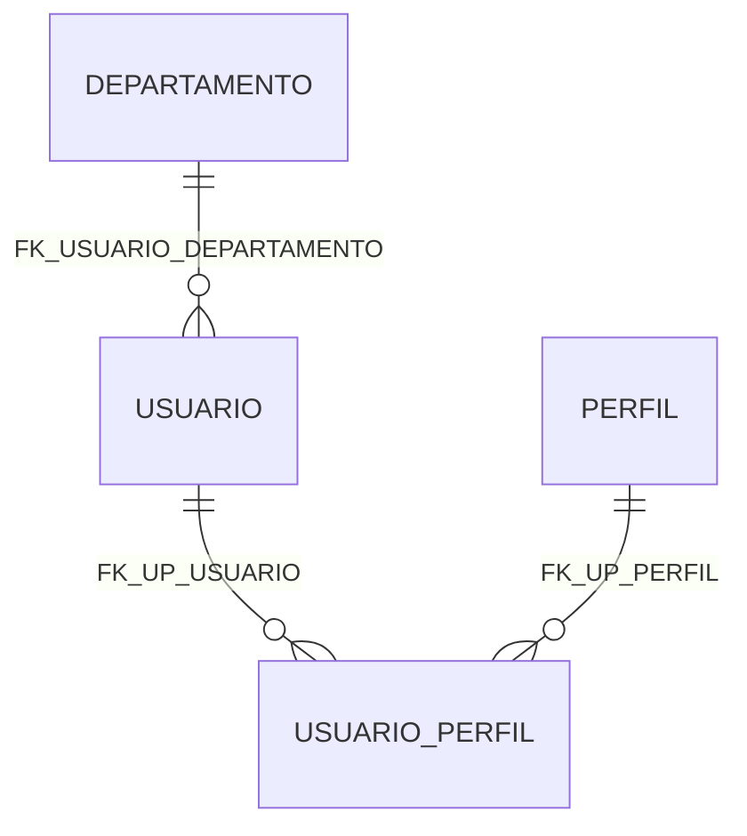

# jed-personal-mcp

A personal MCP (Model Context Protocol) server for local development, written in Go. 

Provides database access to a local Firebird 5 instance.

Is suitable for use with the [Zed Editor](https://zed.dev) in development tasks.

> **Warning:** This tool is intended for local development only. It is not safe for production use.

## Features

- **`firebird_query`** — Execute a single SQL statement (SELECT, INSERT, UPDATE, CREATE TABLE, etc.)
- **`firebird_show_tables`** — List all tables and views in the database
- **`firebird_describe_table`** — Show the full schema of a table or view (columns, indexes, constraints, triggers)
- **`firebird_describe_database`** — Complete database overview with tables, columns, and Mermaid ER diagram
- **`firebird_get_databases`** — List all configured databases
- **`firebird_create_database`** — Create a new Firebird database file (restricted to allowed paths)
- **`firebird_run_script`** — Execute multiple SQL statements in a single transaction
- **`firebird_create_trigger`** — Create a new trigger (uses isql for SET TERM support)
- **`firebird_insert_batch`** — Insert multiple rows in a single transaction (prepared statement)
- **`firebird_count`** — Count rows in a table (with optional WHERE)
- **`firebird_sample`** — Get a sample of rows from a table (with optional WHERE and LIMIT)
- **`firebird_execute_immediate`** — Execute statements with SET TERM blocks (uses isql)

## Prerequisites

- [Go](https://go.dev/) 1.21+
- [Firebird 5](https://www.firebirdsql.org/) server running locally (or reachable over the network)

## Setup

### 1. Configure your server and databases

Edit `config.json`:

```json
{
  "server": {
    "host": "127.0.0.1",
    "port": 3050,
    "user": "SYSDBA",
    "password": "masterkey",
    "allowed_paths": [
      "/databases"
    ],
    "databases": [
      {
        "name": "dev",
        "description": "Local development database",
        "path": "/databases/dev.fdb"
      }
    ],
    "default_database": "dev",
    "isql_path": "/usr/bin/isql"
  }
}
```

**Note:** The `isql_path` field is optional. If not set, the server will automatically search for `isql` or `fbisql` in common locations and PATH. This is required for tools that use SET TERM blocks (`firebird_create_trigger`, `firebird_execute_immediate`).

### 2. Build

```bash
# Build for current platform (development)
./scripts/build.sh

# Build for a specific platform
./scripts/build.sh linux      # linux/amd64 + linux/arm64
./scripts/build.sh darwin     # darwin/amd64 + darwin/arm64
./scripts/build.sh windows    # windows/amd64 + windows/arm64

# Build for all platforms
./scripts/build.sh all
```
Binaries are output to `bin/`.

### 3. Register in Zed Editor

Add the MCP server to your Zed settings (`~/.config/zed/settings.json`):

```json
{
  "context_servers": {
    "jed-personal-mcp": {
      "command": "/home/edujed/github/jed-personal-mcp/bin/jed-personal-mcp",
      "enabled": true,
      "env": {
        "FIREBIRD_CONFIG": "/home/edujed/github/jed-personal-mcp/config.json"
      },
      "timeout": 20
    }
  }
}
```

| Field | Description |
|---|---|
| `command` | Absolute path to the built binary |
| `enabled` | Whether the server is active (`true`/`false`) |
| `env.FIREBIRD_CONFIG` | Path to `config.json` (optional — defaults to `./config.json` relative to the working directory) |
| `timeout` | Timeout in seconds for server startup |

After saving, Zed will automatically start the MCP server and make the tools available to the agent.

## Configuration

### `config.json`

| Field | Type | Description |
|---|---|---|
| `server.host` | `string` | Firebird server host |
| `server.port` | `int` | Firebird server port |
| `server.user` | `string` | Server admin username |
| `server.password` | `string` | Server admin password |
| `server.allowed_paths` | `array` | Directories where new databases can be created |
| `server.databases` | `array` | List of database configurations |
| `server.default_database` | `string` | Name of the database to use when none is specified |

### Database entry

| Field | Type | Description |
|---|---|---|
| `name` | `string` | Unique identifier used in tool calls |
| `description` | `string` | Human-readable description (optional) |
| `path` | `string` | Path to the `.fdb` file |

### Configuration file lookup

The server looks for the config file in the following order:

1. **`FIREBIRD_CONFIG` environment variable** — if set, this path is used
2. **`./config.json`** — relative to the current working directory

### Environment variables

| Variable | Description |
|---|---|
| `FIREBIRD_CONFIG` | Absolute path to the config file |

## Tools

All tools return results in **Markdown format** for better readability and token efficiency.

### `firebird_query`

Executes a raw SQL statement against the database.

| Argument | Type | Required | Description |
|---|---|---|---|
| `sql` | `string` | Yes | The SQL statement to execute |
| `database` | `string` | No | Database name (defaults to `default_database`) |

**Example output:**

```markdown
### Query Results (3 rows)

Columns: ID (INT), NAME (VARCHAR), CITY (VARCHAR)

ID | NAME | CITY
--- | --- | ---
1 | Alice | São Paulo
2 | Bob | NULL
3 | Charlie | Rio de Janeiro
```

### `firebird_show_tables`

Lists all user tables and views.

| Argument | Type | Required | Description |
|---|---|---|---|
| `database` | `string` | No | Database name (defaults to `default_database`) |

**Example output:**

```markdown
### Tables and Views (5)

NAME | TYPE | COMMENT
--- | --- | ---
CLIENTS | TABLE | Customer records
ORDERS | TABLE | Order data
PRODUCTS | TABLE | Product catalog
ORDERS_VIEW | VIEW | Orders with client info
STATS | TABLE | -
```

### `firebird_describe_table`

Shows the full schema of a table or view, including columns, indexes, constraints, triggers, and generators.

| Argument | Type | Required | Description |
|---|---|---|---|
| `table_name` | `string` | Yes | Table or view name |
| `database` | `string` | No | Database name (defaults to `default_database`) |

**Example output:**

```markdown
### Table: CLIENTS

#### Columns

NAME | TYPE | NULL | DEFAULT | POSITION
--- | --- | --- | --- | ---
ID | INT | NO | - | 1
NAME | VARCHAR(100) | NO | - | 2
EMAIL | VARCHAR(255) | YES | - | 3
CREATED_AT | TIMESTAMP | NO | - | 4

#### Indexes

NAME | UNIQUE | TYPE | COLUMNS
--- | --- | --- | ---
IDX_CLIENTS_ID | YES | 0 | ID
IDX_CLIENTS_EMAIL | NO | 0 | EMAIL

#### Constraints

NAME | TYPE
--- | ---
PK_CLIENTS | PRIMARY KEY

#### Triggers

NAME | TYPE | SEQUENCE
--- | --- | ---
TRG_CLIENTS_AUDIT | 1 | 0
```

### `firebird_describe_database`

Provides a complete overview of the database structure, including all tables, columns, and a Mermaid ER diagram showing relationships.

| Argument | Type | Required | Description |
|---|---|---|---|
| `database` | `string` | No | Database name (defaults to `default_database`) |
| `include_counts` | `boolean` | No | If true, includes row counts for each table. May be slow for large tables. Defaults to `false`. |
| `include_describes` | `boolean` | No | If true, includes column details for each table. Defaults to `true`. |

**Example output:**

```markdown
### Database: teste

#### Tables (9)

**DEPARTAMENTO** (12 rows)
  - ID (INTEGER, PK)
  - NOME (VARCHAR(400))
  - SIGLA (VARCHAR(40))
  - ATIVO (SMALLINT)
  - CRIADO_EM (TIMESTAMP, NOT NULL)
  - ATUALIZADO_EM (TIMESTAMP, NOT NULL)

**USUARIO** (216 rows)
  - ID (INTEGER, PK)
  - NOME (VARCHAR(400))
  - EMAIL (VARCHAR(600))
  - DEPARTAMENTO_ID (INTEGER, NOT NULL)
  - ATIVO (SMALLINT)
  - CRIADO_EM (TIMESTAMP, NOT NULL)
  - ATUALIZADO_EM (TIMESTAMP, NOT NULL)

#### Relationships (Mermaid)

```

### `firebird_get_databases`

Lists all databases defined in `config.json`.

No arguments required.

**Example output:**

```markdown
### Configured Databases (2)

NAME | DESCRIPTION | PATH | DEFAULT
--- | --- | --- | ---
dev | Local development database | /databases/dev.fdb | YES
prod | Production database (read-only) | /databases/prod.fdb | NO
```

### `firebird_create_database`

Creates a new Firebird database file with a fixed page size of 4096 bytes. The path must be within one of the `allowed_paths` directories.

| Argument | Type | Required | Description |
|---|---|---|---|
| `path` | `string` | Yes | Full path for the new `.fdb` file |

### `firebird_run_script`

Executes a SQL script (multiple statements) in a single transaction. Statements are separated by semicolons. If any statement fails, the entire transaction is rolled back.

| Argument | Type | Required | Description |
|---|---|---|---|
| `database` | `string` | Yes | Database name (required to avoid ambiguity) |
| `script` | `string` | No | The SQL script to execute (inline) |
| `path` | `string` | No | Path to a `.sql` file to execute |

> **Note:** Either `script` or `path` must be provided.

### `firebird_create_trigger`

Creates a new trigger in the database. Handles the `SET TERM` delimiter automatically.

| Argument | Type | Required | Description |
|---|---|---|---|
| `database` | `string` | Yes | Database name |
| `trigger_name` | `string` | Yes | Name for the new trigger |
| `table_name` | `string` | Yes | Table the trigger will be associated with |
| `trigger_type` | `string` | Yes | Trigger event: `INSERT`, `UPDATE`, or `DELETE` |
| `timing` | `string` | Yes | Trigger timing: `BEFORE` or `AFTER` |
| `body` | `string` | Yes | The trigger body (SQL statements, without `SET TERM` or `BEGIN/END`) |

### `firebird_insert_batch`

Inserts multiple rows into a table in a single transaction using a prepared statement. More efficient than multiple `firebird_query` calls for individual INSERTs.

| Argument | Type | Required | Description |
|---|---|---|---|
| `database` | `string` | No | Database name (defaults to `default_database`) |
| `table` | `string` | Yes | Table name to insert into |
| `columns` | `string` | Yes | Column names as a JSON array, e.g. `["NAME", "EMAIL"]` |
| `rows` | `string` | Yes | Row data as a JSON array of arrays, e.g. `[["Alice", "a@x.com"], ["Bob", "b@x.com"]]` |

**Example output:**

```
Inserted 2 rows into CLIENTS.
```

### `firebird_count`

Returns the number of rows in a table, optionally filtered by a WHERE clause.

| Argument | Type | Required | Description |
|---|---|---|---|
| `database` | `string` | No | Database name (defaults to `default_database`) |
| `table` | `string` | Yes | Table name to count rows from |
| `where` | `string` | No | Optional WHERE clause (without the WHERE keyword) |

**Example output:**

```
Count: 42 rows in CLIENTS (WHERE STATUS = 'ACTIVE')
```

### `firebird_sample`

Returns a sample of rows from a table (default: 10 rows), optionally filtered by a WHERE clause.

| Argument | Type | Required | Description |
|---|---|---|---|
| `database` | `string` | No | Database name (defaults to `default_database`) |
| `table` | `string` | Yes | Table name to sample from |
| `where` | `string` | No | Optional WHERE clause (without the WHERE keyword) |
| `limit` | `string` | No | Maximum number of rows to return (default: 10) |

**Example output:**

```markdown
### Query Results (10 rows)

Columns: ID (INT), NAME (VARCHAR), STATUS (VARCHAR)

ID | NAME | STATUS
--- | --- | ---
1 | Alice | ACTIVE
2 | Bob | INACTIVE
3 | Charlie | ACTIVE
```

### `firebird_execute_immediate`

Executes a SQL statement that may contain SET TERM blocks (e.g. CREATE PROCEDURE, CREATE GENERATOR, CREATE FUNCTION). For regular DML/DDL, use `firebird_query` instead.

| Argument | Type | Required | Description |
|---|---|---|---|
| `database` | `string` | No | Database name (defaults to `default_database`) |
| `sql` | `string` | Yes | The SQL statement to execute (may include SET TERM blocks) |

**Example output:**

```
Statement executed successfully.
```

## Project Structure

```
├── main.go                  # Entry point: loads config, creates server, starts Stdio
├── config.json              # Server and database configuration
├── internal/
│   ├── config/
│   │   └── config.go        # Config loading, validation, and DSN building
│   ├── firebird/
│   │   └── client.go        # Firebird DB client: queries, schema introspection, DDL
│   └── fbtools/
│       └── handler.go       # Firebird MCP tool handlers + registration
├── go.mod
└── README.md
```

### Design

- **`internal/config`** — Loads and validates `config.json`. Exposes DSN builders and path validation.
- **`internal/firebird`** — Data access layer. Wraps `database/sql` with typed schema introspection (tables, columns, indexes, constraints, triggers, generators).
- **`internal/fbtools`** — Firebird-specific MCP tool handlers and registration. Exposes `Register(s, h)` to wire all Firebird tools into the server.
- **`main.go`** — Thin entry point. Wires config → handler → MCP server.

### Extending with new database engines

To add support for another engine (e.g. PostgreSQL):

1. Create `internal/postgres/` — data access layer (mirrors `internal/firebird/`)
2. Create `internal/pgtools/` — tool handlers + `Register()` function (mirrors `internal/fbtools/`)
3. In `main.go`, call `pgtools.Register(s, pgHandler)` alongside `fbtools.Register(s, fbHandler)`

Each engine is fully self-contained under `internal/`, keeping the entry point minimal.

## License

See [LICENSE](LICENSE).
